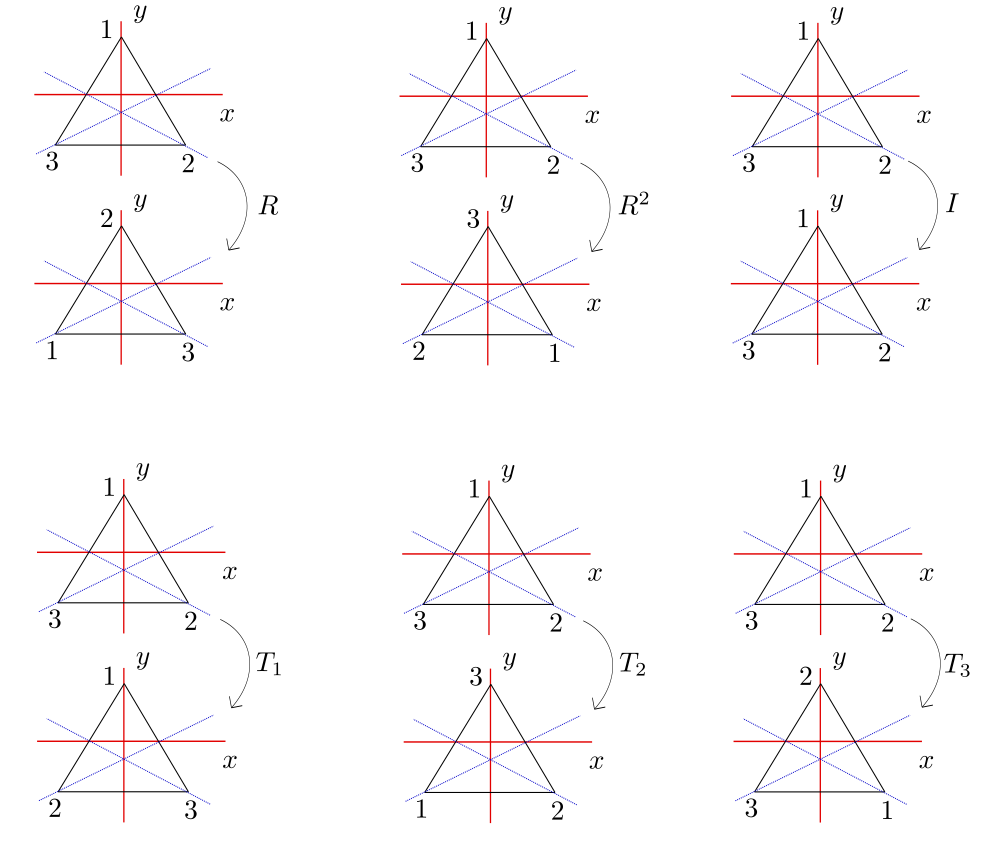
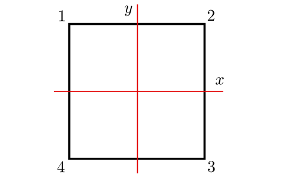

.. role:: underline
    :class: underline

Semigrupos, Monoides y Grupos 
=========================================

Si :math:`G` es un conjunto no vacío, una operación binaria en :math:`G` es una función :math:`G\times G\to G`. Hay varias notaciones de uso común para la imagen de :math:`(a, b)` en una operación binaria:

    - :math:`ab` (notación multiplicativa),
    - :math:`a + b` (notación aditiva),
    - :math:`a . b`,
    - :math:`a \ast b`, etc.

Por conveniencia, generalmente usaremos la notación multiplicativa a lo largo de este capítulo y nos referiremos a :math:`ab` como el producto de :math:`a` y :math:`b`.

Un conjunto puede tener varias operaciones binarias definidas en él (por ejemplo, suma y multiplicación ordinarias en :math:`\mathbb{Z}` dadas por :math:`(a, b)\mapsto a + b` y :math:`(a, b)\mapsto ab` respectivamente).

.. _definicion-de-grupo:

Definición de Grupo
-------------------------

Un **semigrupo** es un conjunto :math:`G` no vacío junto con una operación binaria en :math:`G` que es

    1. Asociativa: :math:`a(bc) = (ab)c` para todo :math:`a, b, c\in G`;
    
    Un **monoide** es un semigrupo :math:`G` que contiene un 
    
    2. elemento de identidad (a ambos lados) :math:`e\in G` tal que :math:`ae = ea = a` para todo :math:`a\in G`;
    
    Un **grupo** es un monoide :math:`G` tal que 
    3. para cada :math:`a\in G` existe un elemento inverso (a ambos lados) :math:`a^{-1}\in G` tal que :math:`a^{-1} a = aa^{-1} = e`.
    
    Un semigrupo :math:`G` es **abeliano** o **conmutativo** si su binaria operación es 
    
    4. conmutativa: :math:`ab = ba` para todo :math:`a, b\in G`. 
    
    Nuestro principal interés son los grupos. Sin embargo, los semigrupos y los monoides son convenientes para enunciar ciertos teoremas con la mayor generalidad. A continuación se dan algunos ejemplos. El **orden** de un grupo :math:`G` es el número cardinal :math:`|G|`. Se dice que :math:`G` es finito [resp. infinito] si :math:`|G|` es finito [resp. infinito].

.. _propiedades-basicas-de-grupos:

Teorema
-------------

Si :math:`G` es un monoide, entonces el elemento de identidad :math:`e` es único. Si :math:`G` es un grupo, entonces

    1. :math:`c \in G` y :math:`cc = c \Rightarrow c = e`; 
    2. para todo :math:`a, b, c \in G : ab = ac \Rightarrow b = c` y :math:`ba = ca \Rightarrow b = c` (cancelación a izquierda y a derecha);
    3. para cada :math:`a \in G`, el elemento inverso :math:`a^{-1}` es único;
    4. para cada :math:`a \in G`, :math:`(a^{-1})^{-1} = a`;
    5. para :math:`a, b \in G`, :math:`(ab)^{-1} = b^{-1}a^{-1}` ;
    6. para :math:`a, b \in G` las ecuaciones :math:`ax = b` y :math:`ya = b` tienen soluciones únicas en :math:`G`: :math:`x = a^{-1}b` y :math:`y = ba^{-1}`.
    
**Prueba**: Si :math:`e'` es también una identidad a ambos lados, entonces :math:`e = ee' = e'e = e'`.

    1. :math:`cc = c \Rightarrow c^{-1}(cc) = c^{-1}c \Rightarrow (c^{-1}c)c = c^{-1}c \Rightarrow ec = e \Rightarrow c = e`;
    
    2. para todo :math:`a, b, c \in G`:
    
        .. math::
            
            \begin{align}
                ab = ac &\Rightarrow a^{-1}(ab) = a^{-1}(ac) \\
                        &\Rightarrow (a^{-1}a)b = (a^{-1}a)c \\
                        &\Rightarrow eb = ec \\
                        &\Rightarrow b = c.
            \end{align}
            
    Análogamente se obtiene que :math:`ba = ca \Rightarrow b = c`, por lo que se cumple la cancelativa a izquierda y a derecha;

    3. para cada :math:`a \in G`, supongamos que existen :math:`a^{-1}` y :math:`a^{\ast}` los elementos inversos :math:`a`. Por definición de elemento inverso se deduce que, :math:`aa^{-1} = e = aa^{\ast}`. Por propiedad cancelativa a izquierda, :math:`a^{-1} = a^{\ast}`. Luego, el elemento inverso :math:`a^{-1}` es único;

    4. para cada :math:`a \in G`, :math:`a^{-1}(a^{-1})^{-1} = e = a^{-1}a` y por cancelativa a izquierda tenemos que :math:`(a^{-1})^{-1} = a`;

    5. :math:`(ab)(b^{-1}a^{-1} ) = a(bb^{-1})a^{-1} = (ae)a^{-1} = aa^{-1} = e \Rightarrow  (ab)^{-1} = b^{-1}a^{-1}` por ítem :math:`3`.

    6. Análogamente al ítem :math:`1`.

.. important::

    - Si :math:`G` es un monoide y la operación binaria se escribe multiplicativamente, entonces el elemento identidad de :math:`G` siempre se denotará como :math:`e`.
    - Si la operación binaria se escribe aditivamente, entonces :math:`a+b` (:math:`a,b \in G`) se llama la suma de :math:`a` y :math:`b`, y el elemento identidad se denota como :math:`=`;
    - si :math:`G` es un grupo, el inverso de :math:`a \in G` se denota por :math:`-a`. Escribimos :math:`a - b` para :math:`a + (-b)`. Los grupos abelianos se escriben con frecuencia de forma aditiva.

Los axiomas utilizados en la :ref:`definicion-de-grupo` pueden debilitarse considerablemente.

.. _proposicion-de-semigrupo:

Proposición
-------------------------

Sea :math:`G` un semigrupo. Entonces :math:`G` es un grupo si y solo si se cumplen las siguientes condiciones:

    :math:`(i)` existe un elemento :math:`e\in G` tal que :math:`ea = a` para todo :math:`a\in G` (elemento de identidad izquierdo);
    
    :math:`(ii)` para cada :math:`a \in G`, existe un elemento :math:`a^{-1}\in G` tal que :math:`a^{-1} a = e` (inverso a la izquierda). 

.. note::

    Un resultado análogo es válido para "inversos a derecha" y una "identidad izquierda".
    
**Bosquejo de la prueba** de esta :ref:`proposicion-de-semigrupo`:
    
    - (:math:`\Rightarrow`) Trivial. 
    - (:math:`\Leftarrow`) Note que el ítem :math:`1`. de la :ref:`definicion-de-grupo` es verdadero bajo estas hipótesis. :math:`G \not = \emptyset` ya que :math:`e\in G`. Si un :math:`a\in G`, entonces por :math:`(ii)`

    .. math::
        
        (aa^{-1}) (aa^{-1}) = a (a^{-1}a)a^{-1} = a (ea^{-1}) = aa^{-1}
        
    y, por tanto, :math:`aa^{-1} = e` según el ítem :math:`1`. de la :ref:`definicion-de-grupo`. Así, :math:`a^{-1}` es una inversa de dos lados de :math:`a`. Dado que :math:`ae = a (a^{-1}a) = (aa^{-1}) a = ea = a` para cada :math:`a\in G`, :math:`e` es una identidad de dos lados, por lo tanto :math:`G` es un grupo según la :ref:`definicion-de-grupo`. :math:`\blacksquare`

Proposición
-------------------------

Sea :math:`G` un semigrupo. Entonces :math:`G` es un grupo si y solo si para todo :math:`a, b\in G` las ecuaciones :math:`ax = b` y :math:`ya = b` tienen soluciones en :math:`G`. 

**Prueba.** Ejercicio; utilice la :ref:`proposicion-de-semigrupo` anterior.

Ejemplos
~~~~~~~~~~~~~

Los números enteros :math:`\mathbb{Z}`, los números racionales :math:`\mathbb{Q}` y los números reales :math:`\mathbb{R}` son cada uno grupos abelianos infinitos bajo adición ordinaria. Cada uno es un monoide bajo multiplicación ordinaria. pero no un grupo (:math:`\mathbb{0}` no tiene inverso). Sin embargo, los elementos distintos de cero de :math:`\mathbb{Q}` y :math:`\mathbb{R}` forman respectivamente grupos abelianos infinitos bajo multiplicación.

Los enteros pares bajo la multiplicación forman un semigrupo que no es un monoide.

Ejemplo: el grupo de simetrías del triángulo
~~~~~~~~~~~~~~~~~~~~~~~~~~~~~~~~~~~~~~~~~~~~

Considere el triángulo con vértices numerados consecutivamente :math:`1`, :math:`2` y :math:`3`, centro en el origen del plano :math:`xy` y cuya base es paralela al eje :math:`x`. 

Sea :math:`D_3^{\ast}` el siguiente conjunto de "transformaciones" del triángulo dado por

.. math::

    D_{3}^{\ast} = \{ R, R^{2}, I, T_{1}, T_{2}, T_{3} \},
    
donde

    - :math:`I` una rotación de :math:`0^{\circ}`,
    - :math:`R` es una rotación en sentido antihorario alrededor del centro de :math:`120^{\circ}`,
    - :math:`R^{2}` una rotación en sentido antihorario de :math:`240^{\circ}`,
    - :math:`T_{1}` es una reflexión sobre la recta que contiene a la altura del triángulo correspondiente al vértice :math:`1`,
    - :math:`T_{2}` es una reflexión sobre la recta que contiene a la altura del triángulo correspondiente al vértice :math:`2`,
    - :math:`T_{3}` es una reflexión sobre la recta que contiene a la altura del triángulo correspondiente al vértice :math:`3`,

.. note::

    Tengamos en cuenta que cada :math:`U \in D_4^{\ast}` es una biyección del triángulo sobre sí mismo.

Definimos la *operación binaria* en :math:`D_{3}^{\ast}` como composición de funciones:
    
    - para :math:`U, V \in D_3^{\ast}`, :math:`U \circ V` es la transformación :math:`V` seguida de la transformación :math:`U`.
    
:math:`D_{3}^{\ast}` es un grupo no abeliano de orden :math:`6` llamado **grupo de simetrías del triángulo**.

.. important::

    Observemos que cada simetría (elemento de :math:`D_{3}^{\ast}`) está completamente determinada por su acción sobre los vértices.

+-----------------+-----------------+-----------------+-----------------+-----------------+-----------------+-----------------+
| :math:`\circ`   | :math:`R`       | :math:`R^{2}`   | :math:`I`       | :math:`T_{1}`   | :math:`T_{2}`   | :math:`T_{3}`   |
+-----------------+-----------------+-----------------+-----------------+-----------------+-----------------+-----------------+
| :math:`R`       | :math:`R^{2}`   | :math:`I`       | :math:`R`       | :math:`R`       | :math:`T_{1,3}` | :math:`T_{x}`   |
+-----------------+-----------------+-----------------+-----------------+-----------------+-----------------+-----------------+
| :math:`R^{2}`   | :math:`I`       | :math:`R`       | :math:`R^{2}`   | :math:`R^{2}`   | :math:`T_{y}`   | :math:`T_{2,4}` |
+-----------------+-----------------+-----------------+-----------------+-----------------+-----------------+-----------------+
| :math:`I`       | :math:`R`       | :math:`R^{2}`   | :math:`I`       | :math:`T_{1}`   | :math:`T_{2}`   | :math:`T_{3}`   |
+-----------------+-----------------+-----------------+-----------------+-----------------+-----------------+-----------------+
| :math:`T_{1}`   | :math:`T_{2,4}` | :math:`T_{y}`   | :math:`T_{1}`   | :math:`I`       |  :math:`I`      | :math:`R`       |
+-----------------+-----------------+-----------------+-----------------+-----------------+-----------------+-----------------+
| :math:`T_{2}`   | :math:`T_{x}`   | :math:`T_{2,4}` | :math:`T_{2}`   | :math:`T_{1,3}` | :math:`I`       | :math:`I`       |
+-----------------+-----------------+-----------------+-----------------+-----------------+-----------------+-----------------+
| :math:`T_{3}`   | :math:`T_{1,3}` | :math:`T_{x}`   | :math:`T_{3}`   | :math:`T_{y}`   | :math:`R^{2}`   | :math:`I`       |
+-----------------+-----------------+-----------------+-----------------+-----------------+-----------------+-----------------+

Ejemplo: el grupo de simetrías del cuadrado
~~~~~~~~~~~~~~~~~~~~~~~~~~~~~~~~~~~~~~~~~~~

Considere el cuadrado con vértices numerados consecutivamente :math:`1`, :math:`2`, :math:`3` y :math:`4`, centro en el origen del plano :math:`xy` y lados paralelos a los ejes. 

Sea :math:`D_4^{\ast}` el siguiente conjunto de "transformaciones" del cuadrado dado por

.. math::

    D_4^{\ast} = \{ R, R^{2}, R^{3}, I, T_{x}, T_{y}, T_{1,3}, T_{2, 4} \},
    
donde

    - :math:`I` una rotación de :math:`0^{\circ}`,
    - :math:`R` es una rotación en sentido antihorario alrededor del centro de :math:`90^{\circ}`,
    - :math:`R^{2}` una rotación en sentido antihorario de :math:`180^{\circ}`,
    - :math:`R^{3}` una rotación en sentido antihorario de :math:`270^{\circ}`,
    - :math:`T_{x}` es una reflexión sobre el eje :math:`x`,
    - :math:`T_{1,3}` una reflexión sobre la diagonal que pasa por los vértices :math:`1` y :math:`3`,
    - :math:`T_{y}` es una reflexión sobre el eje :math:`y`,
    - :math:`T_{2,4}` una reflexión sobre la diagonal que pasa por los vértices :math:`2` y :math:`4`;
    
.. note::

    Tengamos en cuenta que cada :math:`U \in D_4^{\ast}` es una biyección del cuadrado sobre sí mismo.

Definimos la *operación binaria* en :math:`D_4^{\ast}` como composición de funciones:
    
    - para :math:`U, V \in D_4^{\ast}`, :math:`U \circ V` es la transformación :math:`V` seguida de la transformación :math:`U`.
    
:math:`D_4^{\ast}` es un grupo no abeliano de orden :math:`8` llamado **grupo de simetrías del cuadrado**. Observemos que cada simetría (elemento de :math:`D_4^{\ast}`) está completamente determinada por su acción sobre los vértices.

+-----------------+-----------------+-----------------+-----------------+-----------------+-----------------+-----------------+-----------------+-----------------+
| :math:`\circ`   | :math:`R`       | :math:`R^{2}`   | :math:`R^{3}`   | :math:`I`       | :math:`T_{x}`   | :math:`T_{1,3}` | :math:`T_{y}`   | :math:`T_{2,4}` |
+-----------------+-----------------+-----------------+-----------------+-----------------+-----------------+-----------------+-----------------+-----------------+
| :math:`R`       | :math:`R^{2}`   | :math:`R^{3}`   | :math:`I`       | :math:`R`       | :math:`T_{1,3}` | :math:`T_{x}`   | :math:`T_{2,4}` | :math:`T_{y}`   |
+-----------------+-----------------+-----------------+-----------------+-----------------+-----------------+-----------------+-----------------+-----------------+
| :math:`R^{2}`   | :math:`R^{3}`   | :math:`I`       | :math:`R`       | :math:`R^{2}`   | :math:`T_{y}`   | :math:`T_{2,4}` | :math:`T_{x}`   | :math:`T_{1,3}` |
+-----------------+-----------------+-----------------+-----------------+-----------------+-----------------+-----------------+-----------------+-----------------+
| :math:`R^{3}`   | :math:`I`       | :math:`R`       | :math:`R^{2}`   | :math:`R^{3}`   | :math:`T_{2,4}` | :math:`T_{y}`   | :math:`T_{1,3}` | :math:`T_{x}`   |
+-----------------+-----------------+-----------------+-----------------+-----------------+-----------------+-----------------+-----------------+-----------------+
| :math:`I`       | :math:`R`       | :math:`R^{2}`   | :math:`R^{3}`   | :math:`I`       | :math:`T_{x}`   | :math:`T_{1,3}` | :math:`T_{y}`   | :math:`T_{2,4}` |
+-----------------+-----------------+-----------------+-----------------+-----------------+-----------------+-----------------+-----------------+-----------------+
| :math:`T_{x}`   | :math:`T_{2,4}` | :math:`T_{y}`   | :math:`T_{1,3}` | :math:`T_{x}`   |  :math:`I`      | :math:`R`       | :math:`R^{2}`   | :math:`R^{3}`   |
+-----------------+-----------------+-----------------+-----------------+-----------------+-----------------+-----------------+-----------------+-----------------+
| :math:`T_{1,3}` | :math:`T_{x}`   | :math:`T_{2,4}` | :math:`T_{y}`   | :math:`T_{1,3}` | :math:`R`       | :math:`I`       | :math:`R^{3}`   | :math:`R^{2}`   |
+-----------------+-----------------+-----------------+-----------------+-----------------+-----------------+-----------------+-----------------+-----------------+
| :math:`T_{y}`   | :math:`T_{1,3}` | :math:`T_{x}`   | :math:`T_{2,4}` | :math:`T_{y}`   | :math:`R^{2}`   | :math:`R^{3}`   | :math:`I`       | :math:`R`       |
+-----------------+-----------------+-----------------+-----------------+-----------------+-----------------+-----------------+-----------------+-----------------+
| :math:`T_{2,4}` | :math:`T_{y}`   | :math:`T_{1,3}` | :math:`T_{x}`   | :math:`T_{2,4}` | :math:`R^{3}`   | :math:`R^{2}`   | :math:`R`       | :math:`I`       |
+-----------------+-----------------+-----------------+-----------------+-----------------+-----------------+-----------------+-----------------+-----------------+

Ejemplo: el grupo de permutaciones de un conjunto
~~~~~~~~~~~~~~~~~~~~~~~~~~~~~~~~~~~~~~~~~~~~~~~~~

Sea :math:`S` un conjunto no vacío y :math:`A(S)` el conjunto de todas las biyecciones :math:`S \to S`. Bajo la operación de composición de funciones, :math:`f\circ g`, :math:`A(S)` es un grupo, ya que la composición es asociativa, la composición de biyecciones es una biyección, Es una biyección, y toda biyección tiene una inversa. Los elementos de :math:`A(S)` se llaman permutaciones y :math:`A(S)` se llama grupo de permutaciones en el conjunto :math:`S`. Si :math:`S=\{1,2,3,\dots, n\}`, entonces :math:`A(S)` se llama el grupo simétrico en :math:`n` letras y denotado :math:`S_{n}`. Verifique que :math:`|S| = n!` (Ejercicio 5). Los grupos :math:`S_{n}` juegan un papel importante en la teoría de grupos finitos.

Dado que un elemento :math:`\sigma` de :math:`S_{n}` es una función en el conjunto finito :math:`S=\{1,2,3,\dots, n\}`, se puede describir enumerando los elementos de :math:`S_{n}` en una línea y la imagen de cada elemento debajo de :math:`\sigma` directamente debajo de él: :math:`\sigma = \left(\begin{smallmatrix}1 & 2 & 3 & \cdots & n-1 & n \\i_{1} & i_{2} & i_{3} & \cdots &  i_{n-1}  & i_{n}\end{smallmatrix}\right)`.

El producto :math:`\sigma\tau` de dos elementos de :math:`S_{n}` es la función de composición :math:`\tau` seguida de :math:`\sigma`; es decir, la función sobre :math:`S` dada por :math:`k \mapsto \sigma(\tau(k))`. Por ejemplo, sean :math:`\sigma = \left(\begin{smallmatrix} 1 & 2 & 3 & 4 \\3 & 1 & 2 & 4\end{smallmatrix}\right)` y :math:`\tau = \left(\begin{smallmatrix} 1 & 2 & 3 & 4 \\4 & 1 & 2 & 3\end{smallmatrix}\right)` dos elementos de :math:`S_{4}`. Entonces, bajo :math:`\sigma\tau` tenemos que

    - :math:`1\mapsto\sigma\tau(1)=\sigma(\tau(1))=\sigma(4)=4`
    - :math:`2\mapsto\sigma\tau(2)=\sigma(\tau(2))=\sigma(1)=3`
    - :math:`3\mapsto\sigma\tau(3)=\sigma(\tau(3))=\sigma(2)=1`
    - :math:`4\mapsto\sigma\tau(4)=\sigma(\tau(4))=\sigma(3)=2`

entonces :math:`\sigma\tau = \left(\begin{smallmatrix} 1 & 2 & 3 & 4 \\3 & 1 & 2 & 4\end{smallmatrix}\right)\left(\begin{smallmatrix} 1 & 2 & 3 & 4 \\4 & 1 & 2 & 3\end{smallmatrix}\right) = \left(\begin{smallmatrix} 1 & 2 & 3 & 4 \\4 & 3 & 1 & 2\end{smallmatrix}\right)`

Del mismo modo, bajo :math:`\tau\sigma` tenemos que

    - :math:`1\mapsto\tau\sigma(1)=\tau(\sigma(1))=\tau(3)=2`
    - :math:`2\mapsto\tau\sigma(2)=\tau(\sigma(2))=\tau(1)=4`
    - :math:`3\mapsto\tau\sigma(3)=\tau(\sigma(3))=\tau(2)=1`
    - :math:`4\mapsto\tau\sigma(4)=\tau(\sigma(4))=\tau(4)=3`

entonces :math:`\tau\sigma = \left(\begin{smallmatrix} 1 & 2 & 3 & 4 \\4 & 1 & 2 & 3\end{smallmatrix}\right)\left(\begin{smallmatrix} 1 & 2 & 3 & 4 \\3 & 1 & 2 & 4\end{smallmatrix}\right) = \left(\begin{smallmatrix} 1 & 2 & 3 & 4 \\2 & 4 & 1 & 3\end{smallmatrix}\right)`

Este ejemplo también muestra que :math:`S_{n}` no necesita ser abeliano.

Ejemplo: el producto cartesiano de grupos
~~~~~~~~~~~~~~~~~~~~~~~~~~~~~~~~~~~~~~~~~

Otra fuente de ejemplos es el siguiente método para construir nuevos grupos a partir de los antiguos. Sean :math:`G` y :math:`H` grupos con identidades :math:`e_{G}` y :math:`e_{H}` respectivamente. Definimos el **producto cartesiano (o directo) de** :math:`G` **y** :math:`H` como el grupo cuyo conjunto subyacente es :math:`G\times H` y cuya operación binaria viene dada por:

.. math::

     (a,b)(a',b') = (aa',bb'), \text{ donde } a,a' \in  G; b,b' \in H. 

Observe que hay tres operaciones diferentes en :math:`G`, :math:`H` y :math:`G\times H` involucradas en esta última declaración.

Es fácil verificar que

    - :math:`G\times H` es, de hecho, un grupo que es abeliano tanto si :math:`G` como :math:`G` lo son;
    - :math:`(e_{G},e_{H})` es la identidad y
    - :math:`(a^{-1},b^{-1})` la inversa de :math:`(a,b)\in G\times H`.
    - Claramente :math:`|G\times H|=|G||H|` (Introducción - que todavía no hice -, Definición 8.3).

.. _teorema-de-relacion-de-equivalencia:

Teorema
-------------------------

Sea :math:`R` (:math:`\sim`) una relación de equivalencia sobre un monoide :math:`G` tal que :math:`a_{1}\sim a_{2}` y :math:`b_{1}\sim b_{2}` implican :math:`a_{1}b_{1}\sim a_{2}b_{2}` para todo :math:`a_{i}b_{i}\in G`. Entonces el conjunto :math:`G / R` de todas las clases de equivalencia de :math:`G` bajo :math:`R` es un monoide bajo la operación binaria definida por :math:`(\overline{a})(\overline{b}) = \overline{ab}`, donde :math:`\overline{x}` denota la clase de equivalencia de :math:`x\in G`. Si :math:`G` es un grupo (abeliano), entonces :math:`G / R` es un grupo. 

Una **relación de equivalencia** en un monoide :math:`G` que satisface la hipótesis del teorema se llama **relación de congruencia** en :math:`G`.

**Prueba del** :ref:`teorema-de-relacion-de-equivalencia`: Si :math:`\overline{a_{1}} = \overline{a_{2}}` y :math:`\overline{b_{1}} = \overline{b_{2}}` :math:`\overline{a_{i}},\overline{b_{i}}\in G`, entonces :math:`a_{1} \sim a_{2}` y :math:`b_{1} \sim b_{2}` por (20) de la Introducción, Sección 4. Luego, por hipótesis :math:`a_{1}b_{1}\sim a_{2}b_{2}` de modo que :math:`\overline{a_{1}b_{1}} = \overline{a_{2}b_{2}}` de nuevo por (20). Por lo tanto, la operación binaria en :math:`G / R` está bien definida (es decir, independiente de la ecuación de representantes de clase equivalentes).

    - Es asociativo ya que :math:`\overline{a} (\overline{b} \overline{c}) = \overline{a} (\overline{bc}) = \overline{a(bc)} = \overline{(ab)c} = \overline{(ab)}\overline{c} = (\overline{a}\overline{b})\overline{c}`.
    - :math:`\overline{e}` es el elemento de identidad ya que :math:`(\overline{a})(\overline{e}) = \overline{ae} = \overline{a} = \overline{ea} = (\overline{e})(\overline{a})`. Por tanto, :math:`G / R` es un monoide.
    - Si :math:`G` es un grupo, entonces :math:`\overline{a} \in G / R` claramente tiene una inversa :math:`\overline{a^{-1}} \in G / R` ya que :math:`(\overline{a}) (\overline{a^{-1}}) = \overline{aa^{-1}} = \overline{e}` y :math:`(\overline{a^{-1}}) (\overline{a}) = \overline{a^{-1}a} = \overline{e}`. Por lo tanto, :math:`G / R` también es un grupo.
    - De manera similar, :math:`G` abeliano implica :math:`(\overline{a}) (\overline{b}) = \overline{ab} = \overline{ba} = (\overline{b})(\overline{a})`. Por lo tanto, :math:`G / R` abeliano. :math:`\blacksquare`

Ejemplo
~~~~~~~~~~~

Sea :math:`m` un entero fijo. La congruencia módulo :math:`m` es una relación de congruencia en el grupo aditivo :math:`\mathbb{Z}` por Introducción, Teorema 6.8. Sea :math:`\mathbb{Z}_{m}` el conjunto de clases de equivalencia de :math:`\mathbb{Z}` bajo módulo de congruencia :math:`m`. Según el :ref:`teorema-de-relacion-de-equivalencia` 1.5 (con notación aditiva) :math:`\mathbb{Z}_{m}` es un grupo abeliano, con la suma dada por :math:`\overline{a} + \overline{b} = \overline{a + b}`, con :math:`a,b\in\mathbb{Z}`.

La demostración de la Introducción, Teorema 6.8 muestra que :math:`\mathbb{Z}_{m}=\{0,1,2,\dots, m-1\}` de modo que :math:`\mathbb{Z}_{m}` es un grupo finito de orden :math:`m` bajo adición. :math:`\mathbb{Z}_{m}` se denomina grupo (aditivo) de números enteros módulo :math:`m`. De manera similar, dado que :math:`\mathbb{Z}` es un monoide conmutativo bajo multiplicación, y la congruencia módulo :math:`m` también es una relación de congruencia con respecto a la multiplicación (Introducción, Teorema 6.8), :math:`\mathbb{Z}_{m}` es un monoide conmutativo, con la multiplicación dada por :math:`(\overline{a})(\overline{b}) = \overline{ab}` con :math:`a,b \in \mathbb{Z}`. Verifique que para todo :math:`\overline{a}, \overline{b}, \overline{c} \in \mathbb{Z}_{m}`: 

.. math::

    \begin{align}
        \overline{a}(\overline{a} + \overline{a}) &= \overline{a}\overline{a} + \overline{a}\overline{c} \text{ y }\\
        (\overline{a} + \overline{b})\overline{c} &= \overline{a}\overline{c} + \overline{b}\overline{c}.
    \end{align}

Además, si :math:`p` es primo, los elementos distintos de cero de :math:`\mathbb{Z}_{p}` forman un grupo multiplicativo de orden :math:`p-1` (ejercicio 7). Es necesario denotar los elementos de :math:`\mathbb{Z}_{m}` como :math:`\mathbb{Z}_{m}=\{0,1,2,\dots, m-1\}` en lugar de :math:`\mathbb{Z}_{m}=\{\overline{0},\overline{1},\overline{2},\dots, \overline{m-1}\}`. En contexto, esta notación ambigua no causará dificultad y se utilizará siempre que sea conveniente.

Ejemplo
~~~~~~~~~~~~~~~~~

La siguiente relación sobre el grupo aditivo :math:`\mathbb{Q}` de números racionales es una relación de congruencia (ejercicio 8): 

.. math::

    a\sim b \Longleftrightarrow a-b\in\mathbb{Z}

Según el teorema 1.5, el conjunto de clases de equivalencia (denotado :math:`\mathbb{Q} / \mathbb{Z}`) es un grupo abeliano (infinito), con la suma dada por :math:`\overline{a} + \overline{b} = \overline{a+b}`. :math:`\mathbb{Q} / \mathbb{Z}` se denomina grupo de racionales módulo uno.
 
Dado :math:`a_{1},\dots , a_{n}\in G (n> 3)` es intuitivamente plausible que haya muchas formas de insertar paréntesis en la expresión :math:`a_{1}a_{2}\dots a_{n}` para obtener un producto "significativo" en :math:`G` de estos :math:`n` elementos en este orden. Además, es plausible que dos de tales productos puedan probarse iguales mediante el uso repetido de la ley asociativa. Un requisito previo necesario para el estudio adicional de grupos y anillos es una declaración precisa y una prueba de estas conjeturas y otras relacionadas. 

Dada cualquier secuencia de elementos de un semigrupo :math:`G`, :math:`\{a_{1}, a_{2},\dots \}` definimos inductivamente un producto significativo de :math:`a_{1},\dots, a_{n}` (en este orden) como sigue.

    - Si :math:`n = 1`, el único producto significativo es al. Si :math:`n> 1`, entonces un producto significativo se define como cualquier producto de la forma :math:`(a_{1}\cdots a_{m}) (a_{m + 1}\cdots a_{n})` donde :math:`m < n` y :math:`(a_{1}\cdots a_{m})` y :math:`(a_{m + 1}\cdots a_{n})` son productos significativos de :math:`m` y :math:`n - m` elementos respectivamente.
    - Tenga en cuenta que para cada :math:`n > 2` puede haber muchos productos significativos de :math:`a_{1},\dots,a_{n}`.
    - Para cada :math:`n \in N^{\ast}` destacamos un producto significativo en particular definiendo inductivamente el producto :math:`G` estándar como sigue:
    
    .. math::

        \prod_{i=1}^{1} a_{1} = a_{1} \text{ y } \prod_{i=1}^{n} a_{i} = \left( \prod_{i=1}^{n-1} a_{i} \right)a_{n},\text{ para } n>1.
        
    El hecho de que esta definición asigne para cada :math:`n \in N^{\ast}` un elemento único de :math:`G` (que es claramente un producto significativo) es una consecuencia del Teorema de Recursión 6.2 de la Introducción (Ejercicio 16). 

.. _ley-asociativa-generalizada:

Teorema (Ley Asociativa generalizada)
--------------------------------------

Si :math:`G` es un semigrupo y :math:`(a_{1},a_{2},\dots a_{n})\in G` entonces cualesquiera dos productos significativos de :math:`(a_{1},a_{2}\dots, a_{n})` y en este orden son iguales.

**Prueba.** Usamos la inducción para mostrar que para cada n cualquier producto significativo :math:`n` :math:`a_{1}\cdots a_{n}` es igual al producto :math:`n` estándar :math:`\prod_{i=1}^{n} a_{i}`. Esto ciertamente es cierto para :math:`n =1, 2`.

Si :math:`n > 2`, entonces por definición :math:`a_{1}\cdots a_{n}=(a_{1}\cdots a_{m}) (a_{m + 1}\cdots a_{n})` para algunos :math:`m < n`.

Por tanto, por inducción y asociatividad: 

.. math::

    \begin{align}
        a_{1}\cdots a_{n} &= (a_{1}\cdots a_{m}) (a_{m + 1}\cdots a_{n})\\
                          &= \left( \prod_{i=1}^{m} a_{i} \right) \left( \prod_{i=1}^{n-m} a_{m+i} \right)\\
                          &= \left( \prod_{i=1}^{m} a_{i} \right) \left( \left( \prod_{i=1}^{n-m-1} a_{m+i} \right) a_{n} \right)\\
                          &= \left( \left( \prod_{i=1}^{m} a_{i} \right) \left( \prod_{i=1}^{n-m-1} a_{m+i} \right) \right) a_{n} \\
                          &= \left( \prod_{i=1}^{n-1} a_{i} \right) a_{n} \\
                          &= \prod_{i=1}^{n} a_{i}
    \end{align}

En vista del :ref:`ley-asociativa-generalizada`, podemos escribir y escribimos cualquier producto significativo de :math:`a_{1},a_{2}\cdots a_{n}\in G`(G un semi grupo) como :math:`a_{1}a_{2}\cdots a_{n}` sin paréntesis ni ambigüedad. 

Corolario (Ley conmutativa generalizada)
----------------------------------------

Si :math:`G` es un semigrupo conmutativo y :math:`a_{1},a_{2},\dots, a_{n}\in G`, entonces para cualquier permutación :math:`i_{1},i_{2},\dots, i_{n}` de :math:`1,2,\dots, n`, :math:`a_{1}a_{2}\cdots a_{n} = a_{i_{1}}a_{i_{2}}\cdots a_{i_{n}}`

Prueba. Ejercicio. :math:`\blacksquare`

.. _producto-n-estandar:

Definición
----------------------------------------

Sea :math:`G` un semigrupo, :math:`a \in G` y :math:`n \in N^{\ast}`. El elemento :math:`a^{n} \in G` se define como el producto :math:`n` estándar :math:`\prod_{i=1}^{n} a_{i}` con :math:`ai = a` para :math:`1 \leq i \leq n`. Si :math:`G` es un monoide, :math:`a^{0}` es definido como el elemento idetidad :math:`e`. Si :math:`G` es un grupo, entonces para cada :math:`n \in N^{\ast}` se define :math:`a^{-n}` como :math:`(a^{-1})^n\in G`.

Las observaciones que preceden al :ref:`ley-asociativa-generalizada` y al Ejercicio 16 muestran que la exponenciación está bien definida. Por definición, entonces, :math:`a^{1} = a`, :math:`a^{2} = aa`, :math:`a^{2} = (aa)a= aaa`,... , :math:`a^{n} = a^{n-1}a=aa\cdots a` (:math:`n` factores). Tenga en cuenta que podemos tener :math:`a^{m} = a^{n}` con :math:`m \not = n` (por ejemplo, en :math:`\mathbb{C}`, :math:`-1 = i^{2} = i^{6}`).

.. note::

    Si la operación binaria en :math:`G` se escribe aditivamente, entonces escribimos :math:`na` en lugar de :math:`a^{n}`. Por tanto, :math:`0a = 0`, :math:`1a = a`, :math:`na = (n-1)a+a`, etc.

Teorema
----------------------------------------

Si :math:`G` es un grupo [resp. semigrupo, monoide] y :math:`a\in G`, entonces para todo :math:`m, n \in \mathbb{Z}` [resp. :math:`\mathbb{N}^{\ast}`, :math:`\mathbb{N}`]:

    1. :math:`(a^{-1})^{n} = a^{-n}` (notación aditiva: :math:`m(-a) = -(ma)`);
    2. :math:`a^{m}a^{n} = a^{m+n}` (notación aditiva: :math:`ma + na = (m + n)a`); 
    3. :math:`(a^{m})^{n} = a^{mn}` (notación aditiva: :math:`n(ma) = mna`).

**Bosquejo de la prueba**:

    1. Verifique que :math:`(a^{-1})^{n} = a^{-n}` para todo :math:`n\in \mathbb{N}` y que :math:`(a^{-1})^{n} = a^{-n}` para todo :math:`n\in \mathbb{Z}`.
    2. es verdadero para :math:`m > 0` y :math:`n > 0` ya que el producto de un producto estándar :math:`n` y un producto estándar :math:`m` es un producto significativo igual al producto estándar (m + n) según el :ref:`ley-asociativa-generalizada`. Para :math:`m < 0` y :math:`n < 0`, reemplace :math:`a`, :math:`m`, :math:`n` por :math:`a^{-1}`, :math:`-m`, :math:`-n`  y use el argumento anterior. El caso :math:`m = 0` 0 :math:`n = 0` es trivial y los casos :math:`m < 0`, :math:`n > 0` y :math:`m > 0`, :math:`n < 0` se manejan por inducción en :math:`m` y :math:`n` respectivamente.
    3. es trivial si :math:`m = 0`. El caso en el que :math:`m > 0` y :math:`n \in \mathbb{Z}` se demuestra por inducción sobre :math:`m`. Utilice este resultado para probar el caso :math:`m < 0` y :math:`n \in \mathbb{Z}`. 

Ejercicios
----------------

    1. Dar ejemplos distintos a los del texto de semigrupos y monoides que no sean grupos.

    2. Sea :math:`G` un grupo (escrito de forma aditiva), :math:`S` un conjunto no vacío y :math:`M (S, G)` el conjunto de todas las funciones :math:`f: S \rightarrow G`. Se define la suma en :math:`M (S, G)` de la siguiente manera:
    
        - :math:`(f + g) : S \rightarrow G` viene dado por :math:`s \mapsto f (s) + g (s) \in G`.
    
    Demuestre que :math:`M (S, G)` es un grupo, que es abeliano si :math:`G` lo es.

    3. ¿Es cierto que un semigrupo que tiene un elemento de identidad a la izquierda y en el que cada elemento tiene un inverso a la derecha (ver :ref:`proposicion-de-semigrupo` 1.3) es un grupo?.

    4. Escribir una tabla de multiplicar para el grupo :math:`D_{3}^{\ast}` y :math:`D_{4}^{\ast}`.

    5. Demuestre que el grupo simétrico de :math:`n` letras, :math:`\mathbb{S}_{n}`, tiene orden :math:`n!`.

    6. Escriba una tabla de suma para :math:`\mathbb{Z}_{2}\oplus\mathbb{Z}_{2}`. :math:`\mathbb{Z}_{2}\oplus\mathbb{Z}_{2}` se llama **el grupo de cuatro de Klein**. 

    7. Si :math:`p` es primo, entonces los elementos distintos de cero de :math:`\mathbb{Z}_{p}` forman un grupo de orden :math:`p-1` bajo la multiplicación. [Sugerencia: :math:`\overline{a}\not = \overline{0} \Rightarrow (a, p) = 1`; use la Introducción, Teorema 6.5.] Demuestre que este enunciado es falso si :math:`p` no es primo.

    8.
    
        :math:`(a)` La relación dada por :math:`a\sim b \Longleftrightarrow a-b\in\mathbb{Z}` es una relación de congruencia en el grupo aditivo :math:`\mathbb{Q}` [ver :ref:`teorema-de-relacion-de-equivalencia` 1.5].

        :math:`(b)` El conjunto :math:`\mathbb{Q}/\mathbb{Z}` de clases de equivalencia es un grupo abeliano infinito.

    9.
    
        - Sea :math:`p` un primo fijo. Sea :math:`\mathbb{R}_{p}` el conjunto de todos aquellos números racionales cuyo denominador es primo relativo a :math:`p`.
        - Sea :math:`\mathbb{R}^{p}` el conjunto de racionales cuyo denominador es una potencia de :math:`p` (:math:`p^{i}, i \geq 0`).
    
    Demuestre que tanto :math:`\mathbb{R}_{p}` como :math:`\mathbb{R}^{p}` son grupos abelianos bajo la adición ordinaria de racionales.

    10. Sea :math:`p` un primo y sea :math:`\mathbb{Z}(p^{\infty})` el siguiente subconjunto del grupo :math:`\mathbb{Q}/\mathbb{Z}` (ver la página 27):
        
        - :math:`\mathbb{Z}(p^{\infty}) = \{ \overline{a/b} \in \mathbb{Q}/\mathbb{Z}| a,b \in \mathbb{Z} \text{ y } b = p^{i} \text{ para algún } i \geq 0 \}.`
        
    Muestre que :math:`\mathbb{Z}(p^{\infty})` es un grupo infinito bajo la operación de suma de :math:`\mathbb{Q}/\mathbb{Z}`.

    11. Las siguientes condiciones en un grupo :math:`G` son equivalentes:
    
        :math:`(i)` :math:`G` es abeliano;

        :math:`(ii)` :math:`(ab)^{2}=a^{2}b^{2}` para todo :math:`a, b \in G`;
        
        :math:`(iii)` :math:`(ab)^{-1}=a^{-1}b^{-1}` para todo :math:`a, b \in G`;
        
        :math:`(iv)` :math:`(ab)^{n}=a^{n}b^{n}` para todo :math:`n \in \mathbb{Z}` y todo :math:`a, b \in G`;
        
        :math:`(v)` :math:`(ab)^{n}=a^{n}b^{n}` para tres enteros consecutivos :math:`n` y todo :math:`a, b \in G`.
    
    Demuestre que :math:`(v) \Rightarrow (i)` es falso si "tres" se reemplaza por "dos".

    12. Si :math:`G` es un grupo, :math:`a,b\in G` y :math:`bab^{-1} = a^{r}` para algún :math:`r \in \mathbb{N}`, entonces :math:`b^{j}ab^{-j} = a^{r^{j}}` para todo :math:`j \in \mathbb{N}`. 

    13. Si :math:`a^{2} = e` para todos los elementos :math:`a` de un grupo :math:`G`, entonces :math:`G` es abeliano. 
    
    14. Si :math:`G` es un grupo finito de orden par, entonces :math:`G` contiene un elementos :math:`a \not= e` tal que :math:`a^{2} = e`.

    15. Sea  un conjunto finito no vacío con una operación binaria asociativa tal que para todo :math:`a, b, c \in G` :math:`ab = ac\Rightarrow b = c` y :math:`ba = ca \Rightarrow b = c`. Entonces :math:`G` es un grupo. Demuestre que esta conclusión puede ser falsa si :math:`G` es infinito.

    16. Sea :math:`a_{1}, a_{2}, \dots` una secuencia de elementos en un semigrupo :math:`G`. Entonces existe una función única :math:`\psi:\mathbb{N}^{\ast} \rightarrow G` tal que :math:`\psi(1)=a_{1}`, :math:`\psi(2)=a_{1}a_{2}`, :math:`\psi(2)=(a_{1}a_{2})a_{3}` y para :math:`n\geq 1`, :math:`\psi(n+1)=(\psi(n))a_{n+1}`. Tenga en cuenta que :math:`\psi(n)` es precisamente el :math:`n` producto estándar :math:`\displaystyle\prod_{i=1}^{n}a_{i}`. [Sugerencia: aplicando el teorema de recursividad 6.2 de la introducción con :math:`a = a_{i}`, :math:`S = G` y :math:`f_{n}:G\to G` dado por :math:`x \mapsto xa_{n + 2}` produce una función :math:`\phi: \mathbb{N}\to G`. Sea :math:`\psi = \phi\theta`, donde :math:`\theta:\mathbb{N}^{\ast}\to\mathbb{N}` viene dado por :math:`k\mapsto k - 1`.]